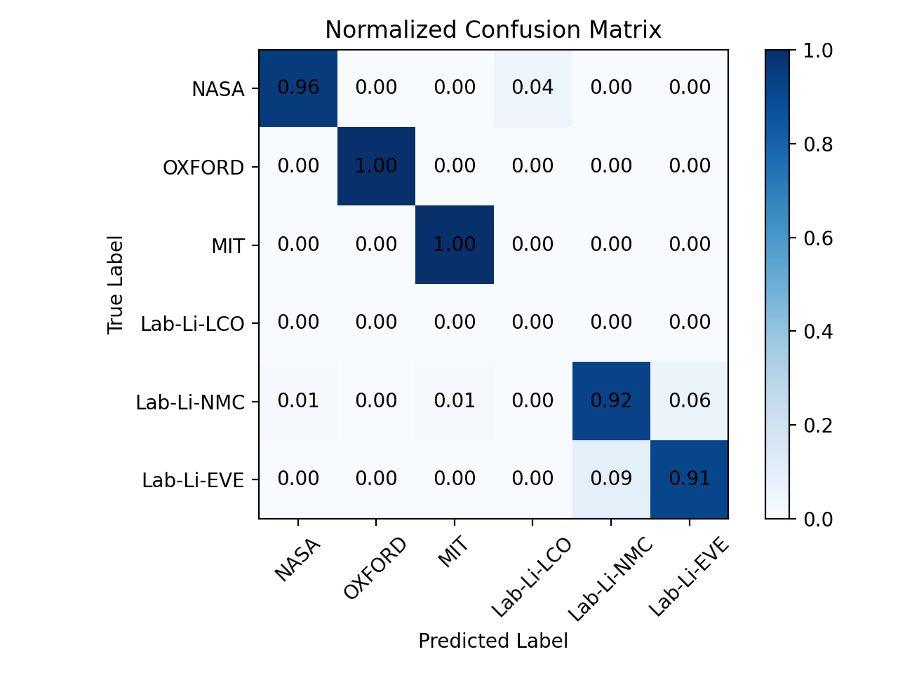

# 🔋 Battery Brand Classification

A feature-based neural network classifier for identifying battery dataset/brand from cycle-level measurements.

This module is designed as a preprocessing stage for RUL and degradation modeling pipelines.

---

## 🎯 Key Features

- Cycle-level statistical feature extraction  
- dV/dSOC feature engineering  
- Leakage-free battery-level split (GroupShuffleSplit)  
- Class imbalance handling  
- Reproducible training (fixed seed)  
- CLI-based training & inference  
- Exportable artifacts for deployment  

---

## 📊 Validation Performance

- Accuracy ≈ 97%  
- Balanced Accuracy ≈ 95%  
- Weighted F1 ≈ 0.97  

---

## 🚀 Training

```bash
python project_1_brand_classifier/train.py \
  --data_dir "PATH_TO_DATABASE"
```

---

## 🔎 Inference

```bash
python project_1_brand_classifier/predict.py \
  --artifacts_dir project_1_brand_classifier/artifacts_brand \
  --file "PATH_TO_NEW_BATTERY.npz"
```

Outputs:

- Per-class probabilities  
- Final predicted brand  
- Confidence score  

---

## 📂 Structure

```text
project_1_brand_classifier/
├── dataset.py
├── model.py
├── train.py
├── predict.py
└── utils.py
```
## 📊 Brand Classification Results

### 🔹 Validation Metrics
See full metrics: `outputs/metrics.json`

---

### 🔹 Normalized Confusion Matrix



---

### 🔹 New Battery Predictions

**EVE_8_B**

See details: `outputs/pred_EVE_8_B.txt`

**OXFORD_8**

See details: `outputs/pred_OXFORD_8.txt`
